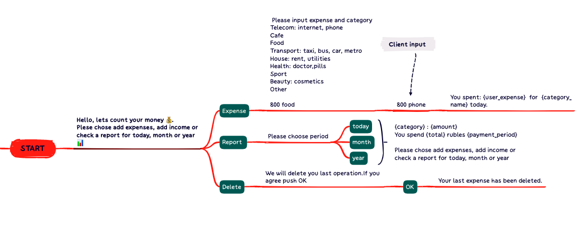
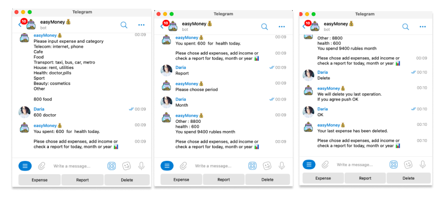

# Telegram bot to count your expenses

To use it you can just clone the project.

Links to repositories:

[BACKEND](https://github.com/easyandmoney/backend)

[BOT](https://github.com/easyandmoney/Bot)

### BACKEND

Please add your own database connection to **easymoney/backend.**

It has to be **.env** file in easymoney folder with

```bash
DB_KEY = postgresql://(your own key)
```

No “ or ‘.

We use [elephantsql.com](http://www.elephantsql.com/) as database and  [valentina-db.com](https://www.valentina-db.com/en/) to test the database.

Also you can use [insomnia.rest/](https://insomnia.rest/)  the easy way to design, debug, and test APIs.

### TELEGRAM BOT

To use our code for telegram bot you have to add you own **.env** file to bot folder.

Please register your bot here @BotFather

There add:

```python
API_KEY = str (@BotFather will give it to you)
//Other you need it if you have restriction for connection in your conntry://
PROXY_URL = str
PROXY_USERNAME = str
PROXY_PASSWORD = str
```
**Bot dialog schema:**



**Bot dialog on the phone:**


